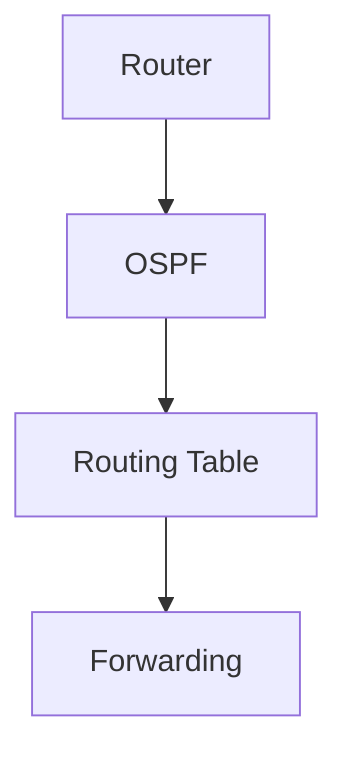

# 🧠 Django Ollama Chat

> A lightweight, customizable, ChatGPT-style local AI interface built with **Django + Ollama + HTML/CSS/JavaScript** — designed to run directly on Windows without Docker or Open WebUI.

    

---

## 📌 What is this project?

This project builds a **local ChatGPT-style web interface around Ollama**.

```text
Browser
   │
   ▼
Django Chat UI
   │
   ▼
Ollama API :11434
   │
   ├── llama3.2:3b
   ├── qwen3:4b
   └── llama3.1:8b
```

The goal is not to replace Open WebUI for every use case. The goal is to provide a small application that you can **own, understand, customize and extend**, especially for AI-assisted NetDevOps work.

---

# ✨ Features

### 🤖 Ollama

- Direct local Ollama API integration
- Automatic model discovery through Ollama
- Dynamic model selector and refresh
- Real streaming responses
- Local model execution
- No cloud API key required for local models

### 💬 Chat

- ChatGPT-style interface
- Multiple independent conversations
- New Chat creates a separate conversation
- Persistent browser history using `localStorage`
- Wide ChatGPT-like reading area
- Copy entire response
- Light/dark mode
- Responsive UI

### 🧠 Thinking control

- Explicit **Think** toggle
- Think OFF by default
- Sends Ollama `think: false` when disabled
- Supports thinking-capable models such as Qwen3
- Uses `/no_think` behavior for compatible Qwen3/DeepSeek-R1-style models
- Removes previous `<think>...</think>` blocks before conversation history is sent again
- Think ON remains an explicit opt-in

> Think OFF prevents supported thinking models from intentionally producing a reasoning trace. It does **not** guarantee identical speed across models: model size, CPU/GPU acceleration, context length and token generation still affect performance.

### 📝 Markdown

- Markdown rendering
- GitHub-style tables
- Headings and lists
- Inline code
- Fenced code blocks
- Preserved indentation

### 💻 Code

- Syntax highlighting with Highlight.js
- Python, JavaScript, TypeScript, Bash, PowerShell, YAML, JSON and more
- Individual **Copy** button for every code block
- Preserved code indentation
- Built-in fallback highlighting if Highlight.js cannot load

### 📊 Mermaid

- Browser-side Mermaid rendering
- Mermaid flowcharts and supported Mermaid diagrams
- Individual **Copy code** button
- Validation before rendering
- Graceful source/error fallback
- Repairs common LLM mistakes
- Normalizes common one-line flowcharts

Example:



Common LLM error:

```text
A -->|Create Socket|> B
```

Safe repair:

```text
A -->|Create Socket| B
```

The application uses Mermaid itself as the final parser, so arbitrary invalid Mermaid is rejected instead of silently inventing a diagram.

---

# 🖥️ Current example models

The development setup used:

```text
NAME           ID              SIZE      MODIFIED
llama3.1:8b    46e0c10c039e    4.9 GB    2 days ago
qwen3:4b       359d7dd4bcda    2.5 GB    2 days ago
llama3.2:3b    a80c4f17acd5    2.0 GB    2 days ago
```

Your IDs, sizes and timestamps will vary.

Check installed models with:

```powershell
ollama list
```

---

# 🚀 1. Install Ollama on Windows

Ollama runs natively on Windows and exposes its local API at `http://127.0.0.1:11434`.

Official PowerShell installation:

```powershell
irm https://ollama.com/install.ps1 | iex
```

Verify:

```powershell
ollama --version
```

You can also use the normal Ollama Windows installer.

---

# 🤖 2. Download and run your first model

Example:

```powershell
ollama run llama3.2:3b
```

Or explicitly download it first:

```powershell
ollama pull llama3.2:3b
```

Then:

```powershell
ollama run llama3.2:3b
```

---

# 📦 3. Add different models

Install additional models without changing the Django application:

```powershell
ollama pull qwen3:4b
ollama pull llama3.1:8b
```

Verify:

```powershell
ollama list
```

Refresh the Django model selector. The application discovers installed models dynamically.

Try a model directly:

```powershell
ollama run qwen3:4b
```

or:

```powershell
ollama run llama3.1:8b
```

---

# 🧰 4. Useful Ollama commands

```powershell
# List installed models
ollama list

# Download a model
ollama pull qwen3:4b

# Run a model
ollama run qwen3:4b

# Show model information
ollama show qwen3:4b

# Show currently running models
ollama ps

# Stop a running model
ollama stop qwen3:4b

# Remove a model
ollama rm qwen3:4b

# Start Ollama manually
ollama serve
```

---

# 🧪 5. Test Ollama before Django

Run:

```powershell
ollama run llama3.2:3b
```

Ask:

```text
Explain BGP in simple terms.
```

You can also test the local API:

```powershell
Invoke-RestMethod http://127.0.0.1:11434/api/tags
```

If installed models are returned, the Ollama API is reachable.

---

# 🐍 6. Install Python

Python 3.12 is recommended for this project.

Check:

```powershell
python --version
```

---

# 📁 7. Create the Django environment

From the project directory:

```powershell
python -m venv .venv
```

Install dependencies:

```powershell
.\.venv\Scripts\python.exe -m pip install -r requirements.txt
```

---

# 🗄️ 8. Initialize and start Django

```powershell
.\.venv\Scripts\python.exe manage.py migrate
.\.venv\Scripts\python.exe manage.py runserver
```

Open:

```text
http://127.0.0.1:8000/
```

After frontend changes, use:

```text
Ctrl + Shift + R
```

for a hard browser refresh.

---

# 🔄 Complete setup in one sequence

```powershell
# 1. Install Ollama
irm https://ollama.com/install.ps1 | iex

# 2. Verify
ollama --version

# 3. Download/run a model
ollama run llama3.2:3b

# 4. Add more models if required
ollama pull qwen3:4b
ollama pull llama3.1:8b

# 5. Check models
ollama list

# 6. Go to the Django project
cd django_ollama_chat

# 7. Create Python environment
python -m venv .venv

# 8. Install dependencies
.\.venv\Scripts\python.exe -m pip install -r requirements.txt

# 9. Django database initialization
.\.venv\Scripts\python.exe manage.py migrate

# 10. Start web application
.\.venv\Scripts\python.exe manage.py runserver
```

Open:

```text
http://127.0.0.1:8000/
```

---

# 🔌 Architecture

```text
                 LOCAL WINDOWS MACHINE
┌─────────────────────────────────────────────────┐
│                                                 │
│ Browser                                          │
│ http://127.0.0.1:8000                           │
│        │                                        │
│        ▼                                        │
│ ┌──────────────────────────┐                    │
│ │          Django          │                    │
│ │                          │                    │
│ │ Chat UI / API            │                    │
│ │ Model discovery          │                    │
│ │ Streaming                │                    │
│ │ Conversation handling    │                    │
│ │ Think control            │                    │
│ └────────────┬─────────────┘                    │
│              │                                  │
│              ▼                                  │
│ ┌──────────────────────────┐                    │
│ │          Ollama          │                    │
│ │    127.0.0.1:11434      │                    │
│ └────────────┬─────────────┘                    │
│              │                                  │
│       ┌──────┼──────────────┐                   │
│       ▼      ▼              ▼                   │
│   Llama 3.2 Qwen3       Llama 3.1             │
│      3B       4B            8B                 │
│                                                 │
└─────────────────────────────────────────────────┘
```

---

# 🆚 Django Ollama Chat vs Open WebUI

This is a **different design goal**, not simply a feature-count competition.

Open WebUI is a broad self-hosted AI platform with support for Ollama and other providers, plus features such as RAG/knowledge, web search, tools, agents, administration and integrations.

This Django project deliberately focuses on a **small, understandable, application-specific AI interface**.

| Area | Django Ollama Chat | Open WebUI |
|---|---|---|
| Main goal | Build your own AI application | Complete AI platform |
| Backend | Django | Open WebUI backend |
| Frontend | Your HTML/CSS/JS | Open WebUI frontend |
| Ollama | Direct local API | Supported provider |
| Docker required | ❌ No | ❌ Not strictly; Docker is an officially recommended path |
| UI customization | ⭐⭐⭐⭐⭐ | ⭐⭐⭐ |
| Learning value | ⭐⭐⭐⭐⭐ | ⭐⭐ |
| Django integration | ⭐⭐⭐⭐⭐ | External integration |
| Custom business logic | ⭐⭐⭐⭐⭐ | Depends on extensions/configuration |
| Lightweight local project | ⭐⭐⭐⭐⭐ | ⭐⭐⭐ |
| Built-in RAG | ❌ | ✅ |
| Web search | ❌ | ✅ |
| Agents/tools | ❌ | ✅ |
| Admin platform | Minimal | ✅ |
| Analytics | Minimal | ✅ |
| Multi-user platform | Not the focus | ✅ |
| Production platform features | Minimal | Extensive |
| Source-level ownership | Your application | Upstream project |
| NetDevOps customization | ⭐⭐⭐⭐⭐ | ⭐⭐⭐ |
| Best for learning Django + AI | ⭐⭐⭐⭐⭐ | ⭐⭐ |
| Best for ready-made AI platform | ⭐⭐⭐ | ⭐⭐⭐⭐⭐ |

### The key idea

```text
Open WebUI
    ↓
Use a complete AI platform

Django Ollama Chat
    ↓
Build your own AI application
```

If you need RAG, web search, agents, knowledge bases, multi-user administration and many integrations immediately, Open WebUI is designed for that.

If you want to understand each application layer and build your own workflows around Ollama, Django gives you direct control.

---

# 🐳 Why no Docker?

Docker is excellent for reproducible environments, isolation, CI/CD, deployment and production packaging.

But a single-machine Windows learning project does not necessarily need another infrastructure layer.

### Native approach

```text
Browser
   ↓
Django
   ↓
Ollama
   ↓
Local model
```

### Containerized approach

```text
Browser
   ↓
Docker Desktop
   ↓
Container
   ↓
Application
   ↓
Container/host networking
   ↓
Ollama
```

For this project, avoiding Docker means:

- No Docker Desktop dependency
- No container networking setup
- No container volumes
- Easier Windows debugging
- Direct Python/IDE debugging
- Direct access to Django source
- Direct access to Ollama
- Less infrastructure overhead for a personal lab

### When Docker is better

Choose Docker when you need:

- Reproducible deployment
- Multiple services
- CI/CD packaging
- Team environments
- Production-like infrastructure
- Kubernetes/container orchestration

So this project is **Docker-free by design**, not because Docker is inherently bad.

---

# 🌐 Why Django is especially interesting for NetDevOps

Django can become the application layer for a local AI-assisted network automation platform.

```text
                 Network Engineer
                        │
                        ▼
                  Django Web UI
                        │
          ┌─────────────┼─────────────┐
          ▼             ▼             ▼
       Ollama         NetBox        GitLab
          │             │             │
          ▼             ▼             ▼
       Local AI      Inventory        Git
          │
          ▼
   Network Automation
          │
      ┌───┼────┐
      ▼   ▼    ▼
   Cisco Juniper Linux
```

Possible extensions:

- NetBox
- Netmiko
- NAPALM
- pyATS / Genie
- Ansible
- AWX
- GitLab
- Jenkins
- Batfish
- Terraform
- RESTCONF
- NETCONF
- SNMP
- Streaming telemetry
- PostgreSQL
- Prometheus
- Grafana

The chat interface can eventually become an **AI control plane for NetDevOps workflows**.

---

# 🔐 Local AI and privacy

For local Ollama models, inference runs on the local machine.

```text
Prompt
  ↓
Django
  ↓
Ollama
  ↓
Local model
  ↓
Response
```

No external LLM API key is required for the local-model path.

> Note: this build loads Markdown, Highlight.js and Mermaid frontend assets from CDNs. Internet access is therefore required for those browser assets unless they are later bundled locally.

---

# ⚡ Performance considerations

Local model performance depends on:

- CPU
- GPU
- RAM
- Model size
- Quantization
- Context length
- Number of generated tokens
- CPU/GPU acceleration
- Whether the model fits comfortably in available memory

The model size shown by `ollama list` is useful, but it is **not a complete prediction of runtime memory usage or speed**.

For smaller-memory machines, 3B/4B models are generally easier to run than much larger models, while an 8B model can provide more capability at a higher compute cost.

---

# 🧩 Custom model with a Modelfile

Ollama also allows custom model definitions.

Example `Modelfile`:

```text
FROM llama3.2:3b

SYSTEM """
You are a network automation assistant.
Prefer Cisco IOS-XE examples.
Explain commands for beginners.
Never invent device output.
"""
```

Create it:

```powershell
ollama create netdevops-assistant -f Modelfile
```

Run it:

```powershell
ollama run netdevops-assistant
```

Refresh the Django model selector.

---

# 🧪 Example prompts

```text
Explain BGP like I am a beginner.
```

```text
Create a Mermaid diagram showing BGP neighbor establishment.
```

```text
Write a Python Netmiko script to collect interface status.
```

```text
Create a GitHub-style table comparing OSPF and BGP.
```

```text
Explain this Cisco configuration and identify possible issues.
```

```text
Create a Mermaid flowchart for a NetDevOps CI/CD pipeline.
```

---

# 🧭 Project structure

```text
django_ollama_chat/
│
├── manage.py
├── requirements.txt
├── README.md
│
├── chat/
│   ├── apps.py
│   ├── urls.py
│   ├── views.py
│   └── __init__.py
│
├── ollama_chat/
│   ├── settings.py
│   ├── urls.py
│   ├── wsgi.py
│   └── __init__.py
│
├── templates/
│   └── chat/
│       └── index.html
│
└── static/
    ├── chat.css
    └── chat.js
```

---

# 🔧 Troubleshooting

### `ollama` command not found

Close and reopen PowerShell after installation, then run:

```powershell
ollama --version
```

### Ollama is not responding

Try:

```powershell
ollama list
ollama run llama3.2:3b
```

Then test:

```powershell
Invoke-RestMethod http://127.0.0.1:11434/api/tags
```

### Django starts but models do not appear

Check:

```powershell
ollama list
Invoke-RestMethod http://127.0.0.1:11434/api/tags
```

If Ollama returns models, refresh the Django page.

### Mermaid does not render

Make sure the browser can reach the CDN assets, then hard-refresh:

```text
Ctrl + Shift + R
```

The application validates Mermaid before rendering and displays the source/error when the syntax cannot be safely repaired.

### Qwen3 seems slow

Check the **Think** toggle.

```text
Think OFF → normal response mode
Think ON  → reasoning mode when supported
```

Think OFF prevents supported thinking behavior but cannot remove normal inference time caused by the model and hardware.

---

# 🧱 Technology stack

```text
Frontend
├── HTML
├── CSS
├── JavaScript
├── Marked.js
├── Highlight.js
└── Mermaid.js

Backend
├── Python
└── Django

Model runtime
└── Ollama

Models
├── Llama
├── Qwen
└── Other Ollama-compatible models
```

---

# 🎯 Why build this yourself?

A ready-made AI UI is excellent when you simply want to use AI.

Building your own UI teaches what happens underneath:

```text
User message
      ↓
Browser
      ↓
HTTP request
      ↓
Django
      ↓
Conversation context
      ↓
Ollama API
      ↓
Local LLM
      ↓
Streaming tokens
      ↓
Django
      ↓
Browser
      ↓
Markdown / Code / Mermaid
```

That knowledge becomes useful when moving from:

```text
AI User
   ↓
AI Developer
   ↓
AI Application Engineer
   ↓
AI-enabled NetDevOps Platform
```

---

# 🚀 Possible roadmap

### Phase 1 — Current

```text
Django + Ollama + Chat + Markdown + Tables + Code + Mermaid
```

### Phase 2

```text
PostgreSQL + Authentication + Persistent server-side conversations
```

### Phase 3

```text
NetBox + Netmiko + NAPALM + pyATS / Genie
```

### Phase 4

```text
GitLab + CI/CD + Batfish + Ansible / AWX
```

### Phase 5

```text
AI-assisted Network Operations Platform
```

---

# ⚖️ Project philosophy

> **Use a ready-made platform when you want a platform. Build your own application when you want control and learning.**

Open WebUI is a strong choice for a complete self-hosted AI platform.

Django Ollama Chat is a strong choice when the objective is to understand and control the application layer yourself.

Neither approach is universally better. The right choice depends on the goal.

---

# 📚 Official resources

- Ollama: https://ollama.com/
- Ollama Windows: https://ollama.com/download/windows
- Ollama documentation: https://docs.ollama.com/
- Ollama GitHub: https://github.com/ollama/ollama
- Django: https://www.djangoproject.com/
- Open WebUI: https://github.com/open-webui/open-webui
- Open WebUI documentation: https://docs.openwebui.com/
- Mermaid: https://mermaid.js.org/
- Highlight.js: https://highlightjs.org/

---

## ⭐ Final note

The interesting part is not the number of files.

The interesting part is that **Django becomes your application layer, Ollama becomes your local model runtime, and the browser becomes your AI interface**.

From there, you can add exactly the capabilities your workflow needs — especially for **NetDevOps, network automation, infrastructure engineering and local AI experimentation**.
